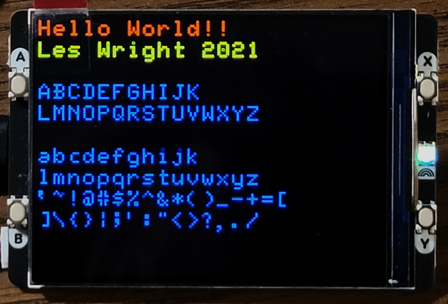

A modification of Les Wright's picofont1.1.py code originally written for the Raspberry Pi Pico Display from Pimoroni to run on the newer Display Pack 2 and 2.8 inch LCDs

Links: 

Les Wright's Github: (https://github.com/leswright1977/picofont)

Pimoroni Pico Display: (https://shop.pimoroni.com/products/pico-display-pack)

Pimoroni Display Pack 2: (https://shop.pimoroni.com/products/pico-display-pack-2-0?variant=39374122582099)

